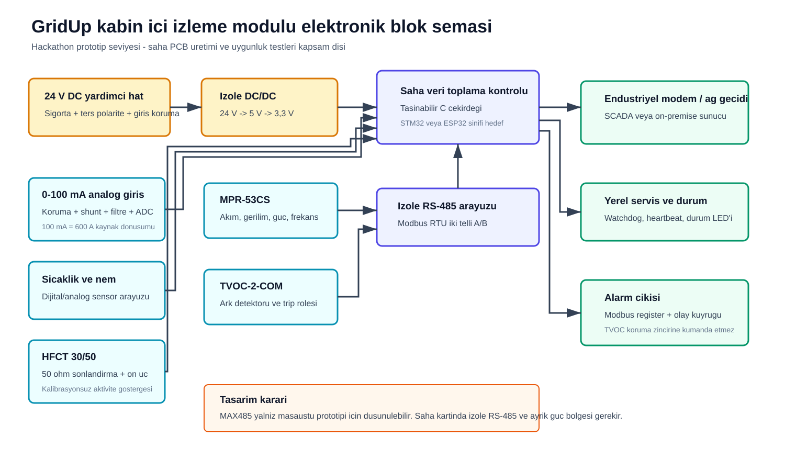
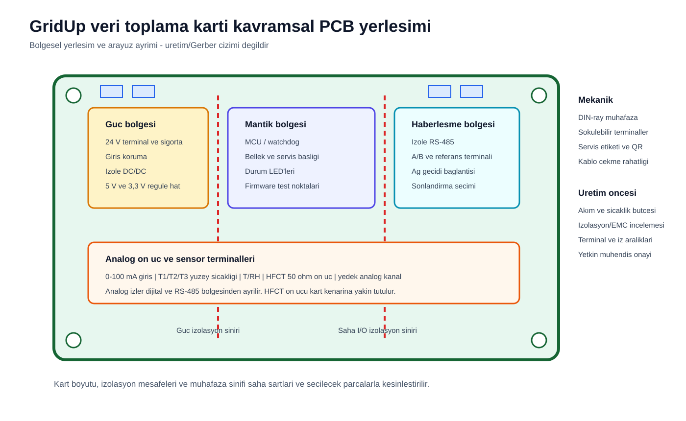
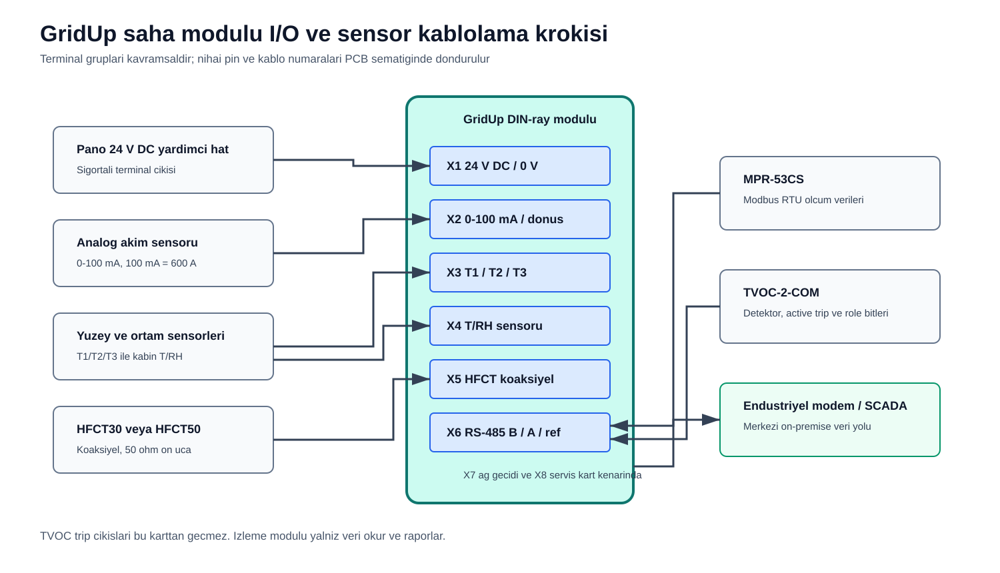

# Elektronik tasarım dokümantasyonu

Kart, mevcut 24 V DC yardımcı hattan beslenen bir veri toplama ve haberleşme modülü olarak
tasarlanmıştır. Koruma rölesi değildir ve TVOC-2'nin yerel trip zincirine kumanda etmez.

## Temel kart yapısı

PCB konsepti dört işlevi ayırır: güç koşullandırma, analog sensör ön ucu, kontrol mantığı ve
haberleşme. İzolasyon sınırları ile saha terminalleri fiziksel olarak ayrılır. Bu çizim,
şartnamenin istediği kart yapısını ve bileşen gruplarını açıklar; üretim Gerber'i değildir.

## I/O bağlantı tablosu

| Terminal | Sinyal | Yön | Elektriksel temsil | Yazılım alanı |
|---|---|---|---|---|
| X1.1/X1.2 | 24 V DC / 0 V | Giriş | Pano yardımcı beslemesi | `auxiliary_supply_v` |
| X2.1/X2.2 | 0-100 mA / dönüş | Giriş | Korumalı analog ön uç | faz veya fider akımı |
| X3.1-X3.6 | T1/T2/T3 sensörleri | Giriş | Analog/dijital, seçime bağlı | `busbar_temperatures_c` |
| X4 | T/RH sensörü | Giriş | Dijital/analog, seçime bağlı | ortam sıcaklığı ve nem |
| X5 | HFCT koaksiyel | Giriş | 50 ohm sonlandırma ve ön uç | `hfct_signal_mv` |
| X6.1/X6.2/X6.3 | RS-485 B/A/referans | Çift yönlü | İzole Modbus RTU | MPR-53CS ve TVOC-2 |
| X7 | Ağ geçidi/modem | Çıkış | Seçilen modem arayüzü | SCADA/merkezi sistem |
| X8 | Servis | Çift yönlü | Programlama ve tanılama | firmware bakım |

## Akım dönüşümü

Kaynak Excel dosyasındaki örnek sensörde 100 mA sekonder 600 A primere karşılık gelir:

`I_primary_A = I_secondary_mA x 600 / 100 = I_secondary_mA x 6`

Örnek: `80 mA x 6 = 480 A`. Analog ön uç değeri ADC aralığına taşır; gerçek shunt ve
kazanç değerleri seçilecek ADC, tolerans ve güç hesabından sonra dondurulur.

## Denetleyici ve RS-485 kararı

Hackathon referans tasarımında STM32 veya ESP32 sınıfı düşük maliyetli bir MCU kullanılabilir.
Firmware çekirdeği üretici HAL'inden bağımsız C olarak sağlanmıştır. MAX485 masaüstü
prototipinde kullanılabilir; saha kartı için güç ve haberleşme izolasyonu içeren RS-485 bölgesi
öngörülür. Kesin parça kodu, kart üretimi planlanmadan önce tedarik ve saha koşullarıyla seçilir.

## HFCT sınırı

HFCT30 ve HFCT50 yüksek frekanslı sensörlerdir. Bu karttaki giriş, kalibre pC ölçüm cihazı
yerine aktivite göstergesi üretir. Kaynakta verilen 100 pC için 0,4 Vpp oranı simülasyonda
kullanılır; saha alarm eşiği olarak sunulmaz.

## Güvenli arıza davranışı

- Modül enerjisiz kalırsa TVOC koruması ve MPR ölçümü çalışmaya devam eder.
- RS-485 kopması koruma komutu üretmez; yalnız iletişim arızası kaydı oluşturur.
- MCU watchdog yeniden başlatması trip rölesine bağlı değildir.
- Analog taşma veya sensör kopukluğu geçerli ölçüm gibi kullanılmaz; kalite durumu üretir.
- Saha kartı yetkin elektrik/elektronik mühendisliği incelemesi olmadan enerjili panoya bağlanmaz.
