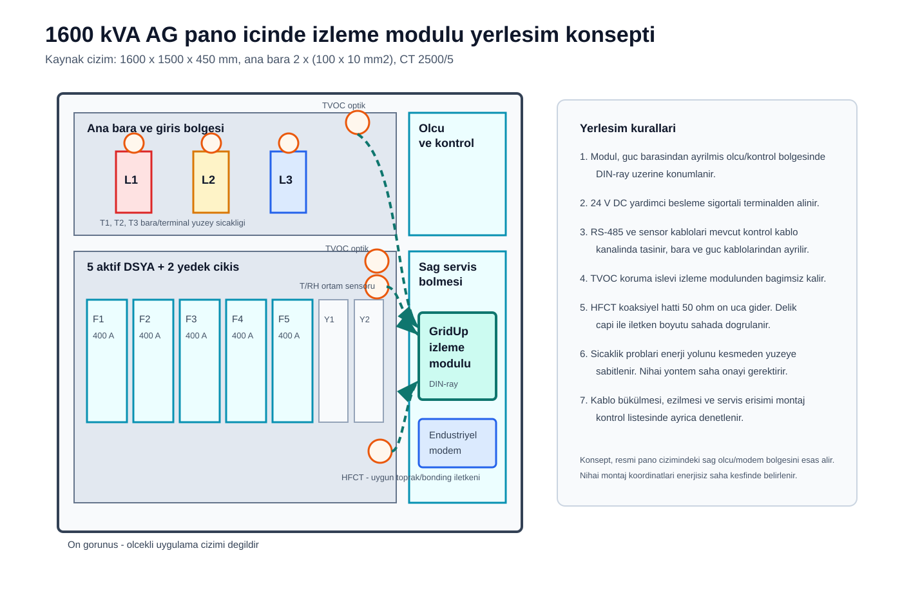

# Kabin içi fiziksel modül tasarımı

Bu tasarım, yarışma kaynaklarındaki 1600 kVA AG pano çizimini ve saha kısıtlarını temel alan
retrofit konseptidir. Amaç, enerji yolunu değiştirmeden sensör ve haberleşme verisini toplamak,
mevcut TVOC koruma işlevini etkilemeden SCADA'ya aktarmaktır.

## Kaynakla doğrulanan pano sınırları

| Özellik | Değer |
|---|---:|
| Pano ölçüsü | 1600 x 1500 x 450 mm |
| Ana bara | 2 x (100 x 10 mm2) kalay kaplı elektrolitik bakır |
| Ana giriş CT | 2500/5 |
| Besleme çıkışı | 5 aktif + 2 yedek |
| Seçilen demo varyantı | 400 A DSYA |
| Modem konumu | Kaynak ön görünüşte sağ üst ölçü/kontrol bölgesi |

## Modül yerleşimi

İzleme modülü, resmi çizimde ölçü cihazı ve modem için ayrılan sağ taraftaki kontrol
bölgesinde DIN-ray üzerine yerleştirilir. Bu alan, ana bara ve DSYA güç yolundan ayrılmıştır.
Kesin koordinat ve boşluk, enerjisiz saha keşfinde kapak hareketi, kablo bükülme yarıçapı,
servis erişimi ve mevcut cihazlarla çakışma kontrol edilerek belirlenir.

## Sensör ve kablo konsepti

| Nokta | Amaç | Bağlantı yaklaşımı |
|---|---|---|
| T1/T2/T3 | Faz bağlantı/bara yüzey sıcaklığı | Enerji yolunu kesmeyen yüzey probu konsepti |
| T/RH | Kabin sıcaklığı ve nem | Kontrol bölgesinde, doğrudan ısı kaynağından uzakta |
| 0-100 mA akım girişi | Kaynak Excel dönüşümünü kullanmak | Korumalı analog terminale iki telli giriş |
| MPR-53CS | Akım, gerilim, güç, frekans | Mevcut Modbus verisini okuma |
| TVOC-2-COM | Ark detektörü, aktif trip ve röle | RS-485 Modbus RTU, korumaya yalnızca gözlemci |
| HFCT 30/50 | PD aktivite göstergesi | Koaksiyel hat ve 50 ohm ön uç; iletken çapı sahada doğrulanır |

Sensör ve RS-485 hatları mevcut kontrol kablo kanalında taşınır. Güç baralarıyla paralel uzun
güzergah, sıkışma, keskin büküm ve servis sırasında çekilme riski kurulum kontrol listesinde
denetlenir. TVOC optik kabloları üretici dokümanındaki ezilmeme ve görüş alanı ilkelerine göre
yerleştirilir.

## Mekanik koruma ve bakım

- Modül sökülebilir terminal kullanan kapalı bir DIN-ray muhafaza içinde düşünülür.
- Besleme ve her I/O grubu sahada okunabilir etiket taşır.
- Modül arızası TVOC'nin yerel açma devresini veya MPR ölçümünü kesmez.
- Güç ve haberleşme bağlantıları önceden hazırlanmış kablo demetiyle tak çalıştır hale getirilir.
- Periyodik bakımda besleme, iletişim heartbeat'i, sensör kopukluğu ve olay sayacı kontrol edilir.

Bu konsept mekanik imalat çizimi değildir. Malzeme yanmazlık sınıfı, IP koruma seviyesi,
montaj delikleri ve termal yükselme saha koşulları ile seçilecek muhafazaya göre kesinleşir.
