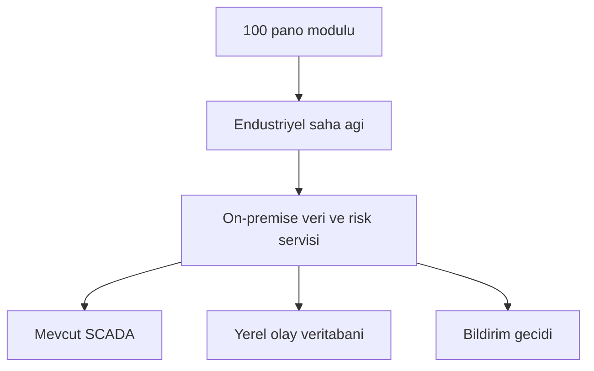

# Ölçeklenebilirlik kaynak kullanımı ve maliyet yaklaşımı

## 100 modül mimarisi

Bir pano iki kaynak cihaz kimliği kullanır: MPR-53CS ve TVOC-2. `AG-001` için unit ID 1 ve
2, `AG-100` için 199 ve 200 kullanılır. Böylece 100 pano tek sunucu sürecinde benzersiz 200
Modbus cihaz görünümüyle temsil edilir.

## Ölçülmüş prototip sonucu

18 Eylül 2026 doğrulamasında 100 pano için 200 simülasyon adımı çalıştırılmıştır:

| Ölçüm | Sonuç |
|---|---:|
| Pano sayısı | 100 |
| Modbus unit ID aralığı | 1-200 |
| Medyan simülasyon adımı | 6,568 ms |
| p95 simülasyon adımı | 13,226 ms |
| Varsayılan veri çevrimi | 1 s |

Bu değerler geliştirme ortamına aittir. Ağ, disk, SCADA tarama süresi veya saha sunucusu
kapasite garantisi değildir.

## Kaynak kullanım kararları

- Tek proses içinde pano başına ayrı model durumu tutulur; her pano için ayrı servis açılmaz.
- SQLite WAL ve `executemany` telemetri yazımı disk kilidi baskısını azaltır.
- WebSocket kuyruğu sınırlıdır; yavaş istemci eski ara çerçeveleri biriktirmez.
- Modbus adresleri deterministik olarak pano sırasından üretilir.
- Public Cloud, yönetilen veritabanı veya pano başına pahalı edge bilgisayar zorunlu değildir.

## Kapasite kabul planı

| Test | Kabul |
|---|---|
| 100 pano bir adım | 100 benzersiz snapshot ve unit ID 1-200 |
| Uzun süreli kayıt | veri tabanı büyümesi ve yazma gecikmesi raporlanır |
| SCADA taraması | her kaynak register beklenen ölçekle okunur |
| Ağ kesintisi | yerel koruma etkilenmez, iletişim arızası görünür olur |
| Yeniden başlatma | servis ve Modbus tekrar ayağa kalkar, veritabanı okunabilir kalır |

## Maliyet yaklaşımı

`bom.csv` parça gruplarını ve satın alma durumunu gösterir. Kaynaklar güncel birim fiyat
vermediğinden toplam TL maliyeti uydurulmamıştır. Tekrarlayan pano maliyetini belirleyen ana
kalemler muhafaza, güç koşullandırma, düşük maliyetli MCU, RS-485 arayüzü, seçilen sensörler
ve kablo demetidir. Merkezi yazılım ve SCADA eşleme pano başına tekrar satın alınmaz.

Maliyet çalışması şu formülle teklif geldikten sonra doldurulur:

`Toplam saha maliyeti = merkezi kurulum + N x pano modülü + devreye alma + bakım`

Kablosuz sensör zorunlu olmadığı için yalnız saha kablolamasının risk veya maliyet avantajı
kanıtladığı noktalarda opsiyon olarak değerlendirilir.
