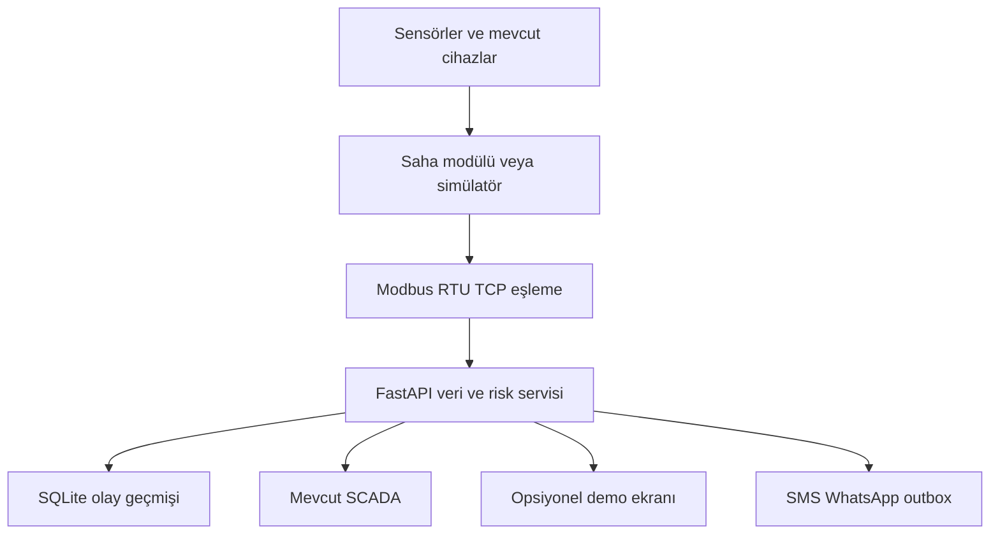
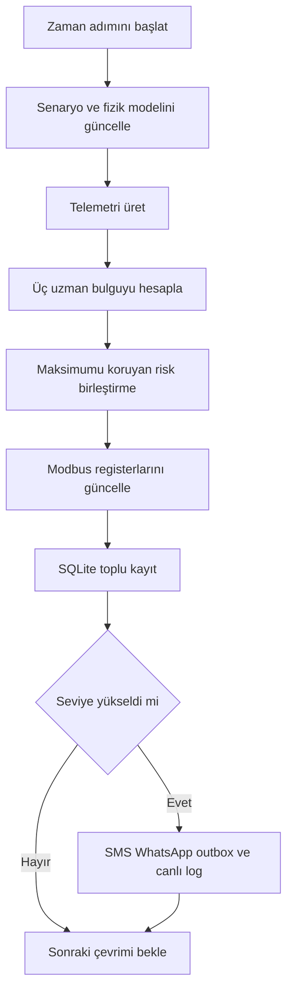

# Yazılım mimarisi ve çalışma akışı

## Katmanlar

Koruma kararı yerel TVOC-2 üzerinde kalır. Merkezi yazılım arkın algılandığını ve trip
rölesinin çalışıp çalışmadığını ayrı alanlarda taşır.

## Bir çevrimin çalışma sırası

## Uzman modüller

| Modül | Girdiler | Başlıca çıktılar |
|---|---|---|
| Termal ve yük | Faz akımı, fider nominali, ölçülen/beklenen sıcaklık | aşırı yük, dengesizlik, termal artık |
| Çevre ve izolasyon | ortam sıcaklığı, nem, en soğuk yüzey | çiy noktası ve yoğuşma marjı |
| Dielektrik güvenlik | HFCT göstergesi, TVOC detektör/röle | PD aktivite göstergesi, detect-only, trip |

En yüksek tekil risk skoru birleşik skorda korunur. Diğer bulgular yalnız yukarı yönlü sınırlı
katkı sağlar. Bu kural, kritik bir termal bulgunun normal çevresel değerlerle seyrelmesini önler.

## Kaynak kodu eşlemesi

| İşlev | Dosya |
|---|---|
| Fizik ve çevre denklemleri | `backend/gridup/physics.py` |
| Senaryo motoru | `backend/gridup/simulator.py` |
| Uzman kuralları ve risk | `backend/gridup/risk.py` |
| Modbus kaynak ve özel blok | `backend/gridup/modbus.py` |
| REST, WebSocket, yaşam döngüsü | `backend/gridup/api.py` |
| WAL, toplu kayıt ve outbox | `backend/gridup/repository.py` |
| 2D pano ve demo kontrolü | `frontend/src/` |
| Taşınabilir MCU mantık çekirdeği | `firmware/` |
